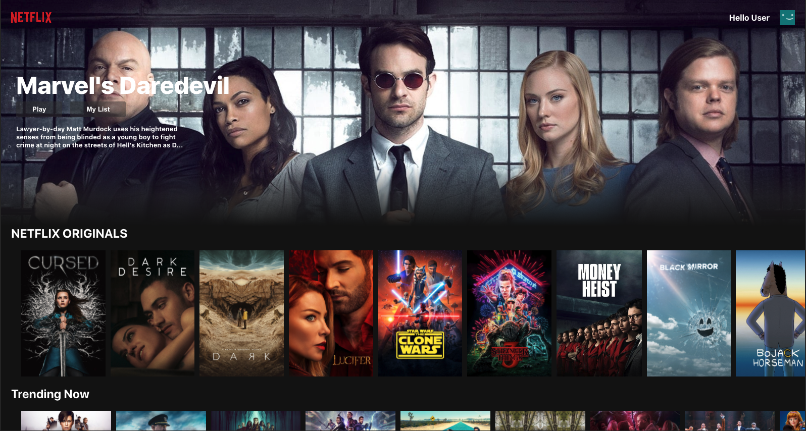
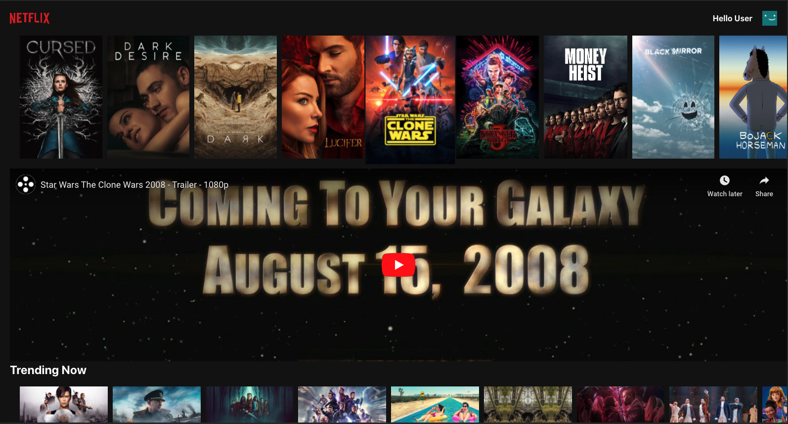

# Netflix Clone

This web application is a very basic Netflix clone that replicates its layout using React. It makes calls to TMDB API in order to get dynamic data into the rows. Each listing will be able to display a movie trailer if it finds one. The user will have the ability to create an account and favorite shows/movies. Authenthication and Database will be done with Firebase.

## Homepage

The Homepage will load dynamic data from the TMDB API in order to populate the banner and movie listings.

When a user clicks on a listing the application will attempt to load a movie trailer.
(Demonstrated below)

## Packages Used

- movie-trailer
- react-youtube
- react-router-dom
- axios
- firebase

## Features

- [x] Play Movie Trailer
- [ ] Setup Firebase auth
- [ ] Setup Firestore database
- [ ] Ability to favorite a post
- [ ] Login Page
- [ ] Signup Page
- [ ] Edit Account

## How To Setup Project

This section is still in development
